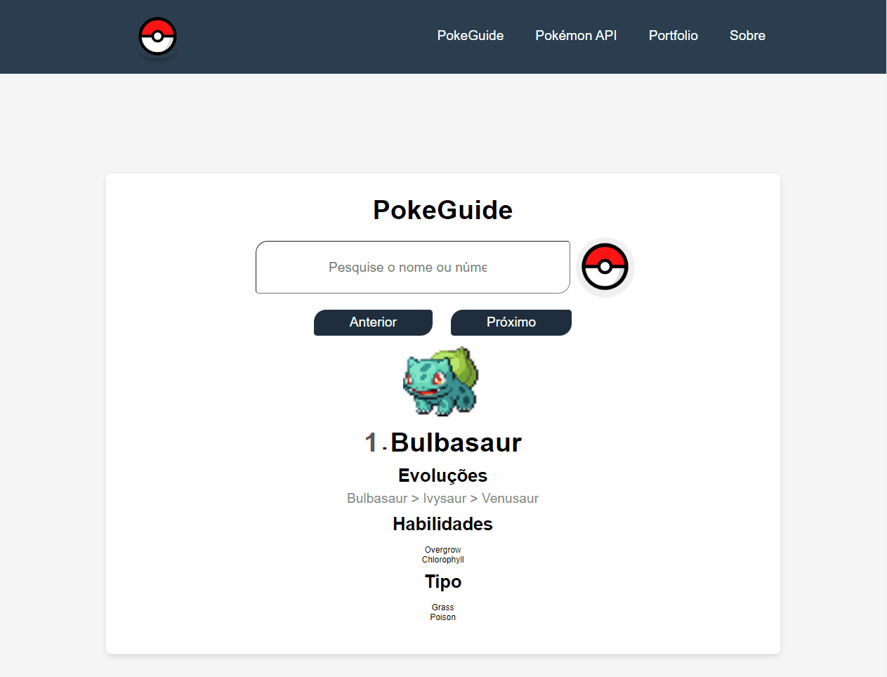

# :rocket: Pokédex

Essa é uma aplicação web que permite visualizar informações sobre diversos Pokémons, utilizando a The RESTful Pokémon API como fonte de dados.

## :bulb: Recursos

A aplicação possui as seguintes funcionalidades:

- Lista de Pokémons: exibe uma lista com todos os Pokémons disponíveis na API, com nome, imagem e número de identificação.

- Detalhes do Pokémon: ao selecionar um Pokémon na lista, exibe informações mais detalhadas sobre o mesmo, como habilidades, tipo, peso, altura, entre outras.

- Busca de Pokémons: permite buscar um Pokémon específico pelo seu nome ou número de identificação.

- Paginação: a lista de Pokémons é paginada, exibindo apenas uma quantidade limitada de Pokémons por página. O usuário pode navegar entre as páginas para ver mais Pokémons.

## :computer: Tecnologias Utilizadas

O projeto foi desenvolvido com as seguintes tecnologias:

- HTML5 e CSS3 para a estruturação e estilização da aplicação.
- JavaScript para a manipulação da DOM e consumo da API.
- A The RESTful Pokémon API como fonte de dados.

## :rocket: Acesse o Projeto

Para visualizar a Pokédex, acesse o seguinte link: [Pokédex](https://dev-paixao.github.io/pokedex/)

## :rocket: Prévia do Projeto

## :clipboard: Como Utilizar

1. Faça o clone deste repositório para o seu ambiente local.

2. Abra o arquivo `index.html` em um navegador web.

3. Explore a lista de Pokémons disponíveis, visualize seus detalhes e utilize a busca para encontrar um Pokémon específico.

4. Divirta-se explorando as informações sobre os Pokémons!

## :handshake: Contribuindo

Contribuições são bem-vindas! Para contribuir com o projeto, siga as etapas abaixo:

1. Faça um fork deste repositório.

2. Crie uma nova branch com uma descrição clara da sua implementação: `git checkout -b nome-da-sua-branch`.

3. Faça as alterações desejadas no código.

4. Realize commits com mensagens descritivas: `git commit -m "Descrição das alterações"`.

5. Envie as alterações para o seu repositório fork: `git push origin nome-da-sua-branch`.

6. Abra um pull request neste repositório, explicando as alterações que foram feitas.

7. Aguarde a revisão e o feedback.

## :page_facing_up: Licença

Essa aplicação está licenciada sob a licença MIT. Veja o arquivo LICENSE.md para mais informações.
